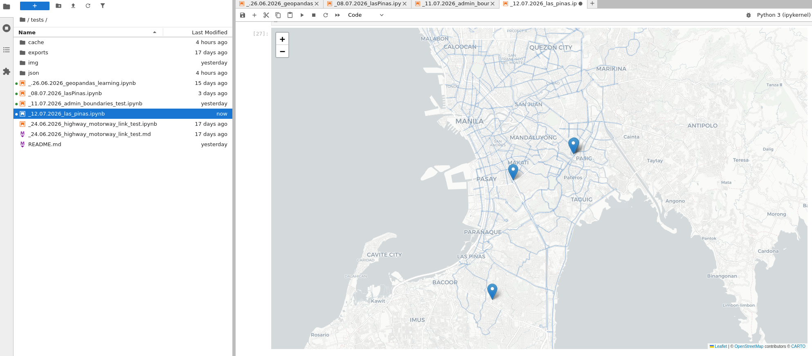
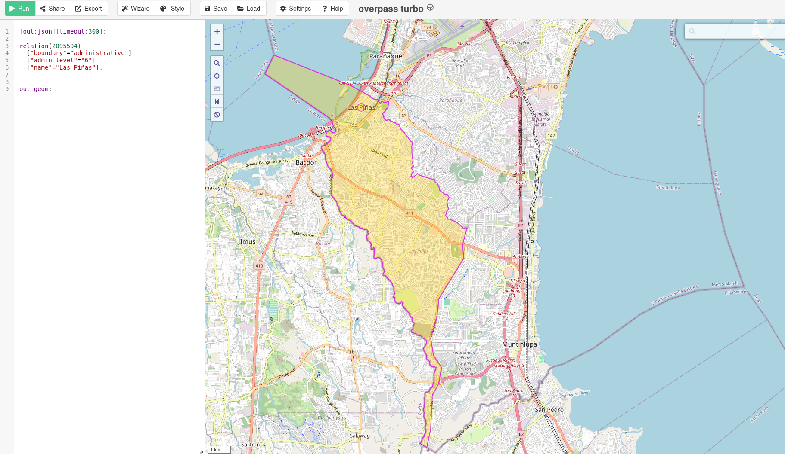
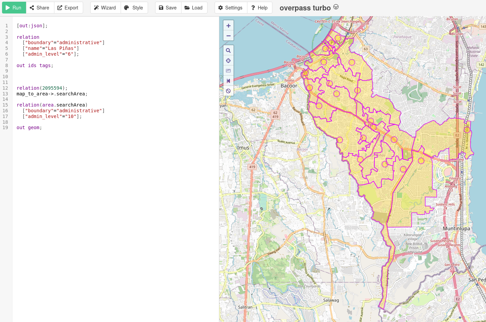
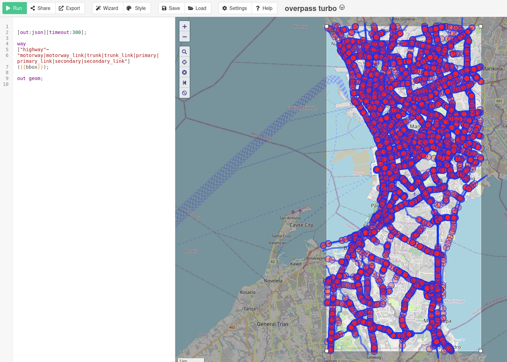

# overpass-turbo

The following file is to track all the downloaded data and sources.   

---

## Map Pin's

> [!12.07.2026]   

map_pins_.12.07.2026.png

---

## Administrative Boundaries

> [!11.07.2026]   

admin_boundaries_11.07.2026.png

---

## Barangay Boundaries

> [!08.07.2026]   

admin_boundaries_barangays_08.07.2026.png

---

## Administrative Boundaries

> [!26.06.2026]   

admin_boundaries_motorway_link_24.06.2026.png

---

## Main Roads

> [!24.06.2026]   

File highway_motorway_link.png

