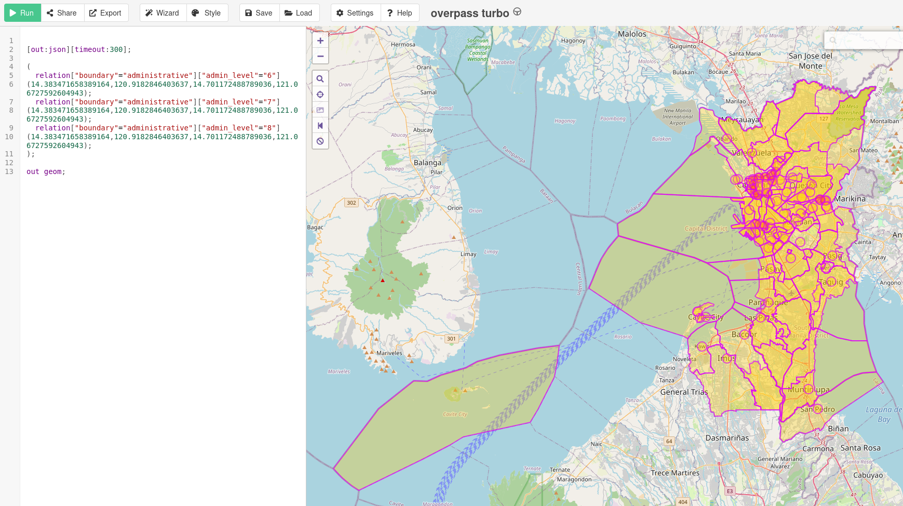
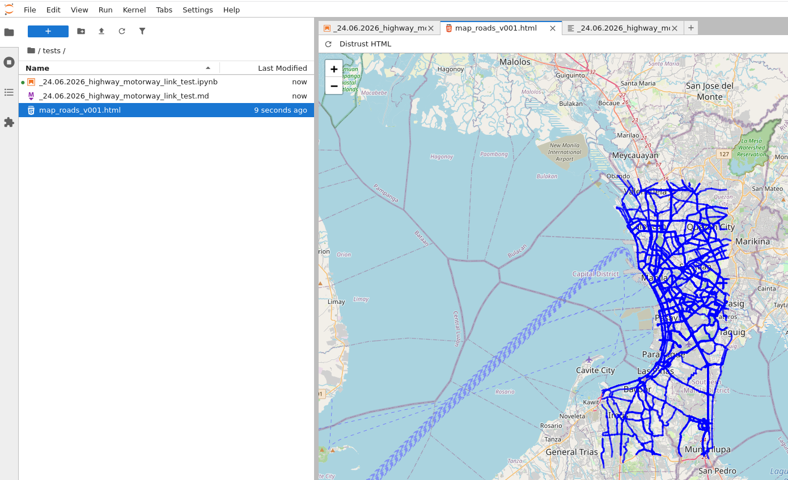

<h1 align="center">README.md</h1>

The files with extension **..ipynb** will not be pushed to GitHub, instead all files will be converted into **.md** file format and images will be exported for presentation.

<h2 align="center">Images</h2>

All the images in this **README.md** file is a collection of all project exports, in all projects you can find specific exports only for that file and project.

<figure align="center">
    
    <figcaption>Administrative boundaries in  Metro Manila</figcaption>
</figure>

<figure align="center">
    
    <figcaption>Administrative boundaries in  Metro Manila</figcaption>
</figure>

<figure align="center">
    
    <figcaption>Road Network in Metro Manila (first test)</figcaption>
</figure>

